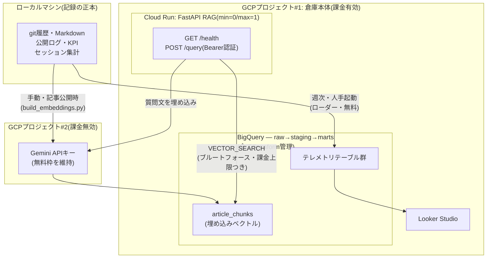

# agent-ops-warehouse

> 🇯🇵 日本語版(翻訳)。**正本は[README.md](README.md)(英語)** — 内容が食い違ったら英語版を正とする。

一人のAIエージェント組織のための運用テレメトリ——BigQueryの倉庫を、全部Terraformで管理し、GCPの無料枠だけで動かす。

個人の小さなAIエージェントStudio(統治ルールを文書化した役割別7体)を運営していて、記事・コード・レビューを出している。このリポジトリはそのStudioの計器盤——何をコミットしたか・何を公開したか・失敗から何を学んだか・KPIがどう動いているかを、逸話でなく問い合わせ可能なテーブルとして持つ。

> **フォーク&デプロイ**: `terraform apply` + `python -m loader` で、あなた自身のGCPプロジェクトに同じ倉庫を数分で作れる。このリポジトリは日記でなくテンプレート。注記: `loader/extract_git.py`の`ALLOWED_REPOS`は作者本人のリポジトリ名にハードコードされている——フォークする場合は先にこのリストを書き換えないと、gitの履歴読み込みが静かに0件を返す。

## なぜ存在するか

AIエージェントを運用する人は増えているのに、それを計測している人はほとんどいない。DevOpsには可観測性のスタックがあるが、個人のAgentOpsには何もない。これは参照実装——小さく、無料で、再現可能で、トレードオフに正直であること。

## アーキテクチャ



あえて2つのGCPプロジェクトに分けている: あるGCPプロジェクトで課金を有効化すると、そのプロジェクトのGemini APIキーは無料枠を**失う**(BigQuery/Cloud Runは課金有効化後も無料枠を維持するのと対照的)。倉庫プロジェクトは課金有効(BigQueryの60日サンドボックス制限を超えるために必要)なので、Geminiキーだけは課金無効な別プロジェクトに置いている。詳細は下記「RAG API」節。

盗んでいい(あるいは異論のある)設計判断:

- **記録の正本はローカルマシンであり、倉庫ではない。** BigQueryの全テーブルは導出データであり、ローダーを再実行すれば元のソースから再構築できる。だからインフラは*再作成*するものであって*インポート*するものではなく、倉庫を失っても損害はゼロ。
- **規模についての正直さ**: このデータは10MB未満。規模だけで言えばDuckDBが正しい選択のはず。BigQueryが勝っているのは*配布*の要件——ゼロ運用のホスティング・共有可能なダッシュボード・RAG APIのリモートSQLバックエンド・恒久的な無料枠。要件が変われば答えも変わる。
- **統治をコードで書く、最後まで。** 組織は文書化されたルールで統治されている。インフラも同じ原則に従う。`terraform plan`がレビューゲート、ドリフト検知が逸脱の警報、予算アラートがコードで書かれたガードレール。
- **専用ベクトルDBを使わないベクトル検索**: RAGフェーズは、監査済みの公開記事コーパスに対してBigQueryの`VECTOR_SEARCH`を使う。このコーパス規模ではベクトルインデックスすら作れない(最低5,000行が必要)——なのでこれはブルートフォース検索だと正直に書いている。面白いのは検索のベンチマークでなく、統治されたコーパスの方。
- **追記専用のraw層**、何を読み込み*何を除外したか*を記録するロード台帳(`raw_load_runs`)付き——除外は公開されているローダーコード内でallowlistとして監査可能。

## あえて作っていないもの

| 作っていないもの | 理由 |
|---|---|
| Airflow / Dagster | 週次・人手起動の読み込みにオーケストレータは不要 |
| GKE / 常時稼働VM | コストの発生源。APIフェーズはCloud Runで足りる |
| ストリーミング取り込み | 週次バッチで十分。ストリーミング挿入も課金対象 |
| 専用ベクトルDB | 分析と検索を1つのエンジン(BigQuery)でやることが本旨 |
| 無人スケジューラ | 読み込みは意図的に人手起動——制約でなく統治上の選択 |

## プライバシー境界

対象は個人のリポジトリと個人のログのみ。git履歴は個人リポジトリの明示的な**allowlist**(`loader/extract_git.py`の`ALLOWED_REPOS`)で絞っている。セッションのテレメトリはローカルで集計する——日次の件数のみで内容は含まない——さらに`AOW_EXCLUDED_DIRS`環境変数で絞り込める。**既定では何も除外しない**ので、`--sessions`が個人以外のセッションログも含むディレクトリを指す場合は自分で設定すること。コミット件名は非公開分析のために読み込むが、公開面には一切表示しない。テストのサンプルデータは合成データ(実際の数値・ファイル名・コミット件名は含まない)。

## クイックスタート

```bash
# 1. インフラ(gcloud auth application-default loginが必要)。
#    これはBigQuery倉庫のみをデプロイする——RAG API(Cloud Run)は
#    別枠のオプトインP3拡張(下記「RAG API」参照)。
cd terraform
echo 'project_id = "your-project"' > terraform.tfvars
terraform init && terraform apply

# 2. 自分のテレメトリを読み込む
python -m loader --repos ~/your-repos/* --out out/
for t in git_commits articles; do
  bq load --source_format=NEWLINE_DELIMITED_JSON --replace raw.$t out/raw_$t.ndjson
done
```

上記の`terraform init`はローカルstateを使う(試す分にはこれで十分)。このリポジトリ自体のデプロイはリモートのGCS backendを使っている——同じ構成にしたい場合は`terraform/backend.hcl.example`を`backend.hcl`(gitignore対象・自分のバケット)にコピーし、`terraform init -backend-config=backend.hcl`を実行する。

無料枠の範囲: BigQueryサンドボックスはカード登録なしで使えるが、組み合わさったときだけ効いてくる2つの制約が付く——テーブルは60日で期限切れ、かつDML(行単位の書き込み・更新)が使えないため、課金を有効化するまでraw層はロード専用になる。どちらの制約も単体では文書化されているが、**この2つが同時に効いたときに何が起きるかは文書化されていない**。課金を有効化するとDML制約は解除されるが、既存データセットの既定の有効期限は自動では解除されない——データセットを更新(または再作成)する必要があり、これはここでは意図的にTerraformのドリフトとして表面化させている。これこそチェックリスト項目をコードにエンコードするやり方。

**クリーンなプロジェクトからの再現を確認済み(2026-08-13):** 新規GCPプロジェクト・事前state無しで`terraform init && terraform apply`——倉庫(データセット3・テーブル8)はapply実行時間にして1分未満で立ち上がる。このテストで2件のバグが発覚・修正済み: `rag_api_image`にデフォルト値が無く(まだ必要ないDockerイメージを先にビルド・pushするまで上記Quickstartの素のapplyがブロックされていた)、GCS backendが著者本人の非公開バケットに固定されていた(他の誰にとっても`terraform init`自体がブロックされていた)。

## RAG API

オプトインのP3拡張であり、上記の基本Quickstartではデプロイされない。まずこのリポジトリルートの`Dockerfile`からイメージをビルド・pushし、`rag_api_image`(`terraform.tfvars`または`-var`)にそのパスを設定して再applyする——`terraform/cloud_run.tf`内のCloud Run/Secret Manager/Artifact Registryの全リソースはこの変数が空でないことをゲート条件にしているため、未設定(既定)のままなら倉庫のみがデプロイされる。

`POST /query`は、公開済み記事コーパスに対して意味検索(BigQueryの`VECTOR_SEARCH`・ブルートフォース——上記「設計判断」参照)を実行し、上位k件の一致チャンクを返す。

```bash
curl -X POST "$RAG_API_URL/query" \
  -H "Authorization: Bearer $RAG_API_TOKEN" \
  -H "Content-Type: application/json" \
  -d '{"question": "your question", "top_k": 5}'

# または、薄いCLIラッパー(同じ環境変数・jqで整形):
scripts/query_articles.sh "your question"
```

`GET /health`は無認証で`{"status": "ok"}`を返す——これが**唯一の**無認証面。FastAPI標準の`/docs`・`/redoc`・`/openapi.json`はこのデプロイでは無効化してある。

**⚠️ 意図的に2つの別々のGCPプロジェクトを使っている。** GCPプロジェクトで課金を有効化すると、そのプロジェクトのGemini APIキー(`ai.google.dev`発行のもの)は無料枠を**失う**——課金有効化後も無料枠を維持するBigQuery/Cloud Runとは対照的。この倉庫プロジェクトは課金有効(BigQueryの60日サンドボックス期限を解除するために必要)なので、`GEMINI_API_KEY`は意図的に**別の、課金無効な**GCPプロジェクトから発行し、Secret Manager経由で注入している。この倉庫プロジェクト自身のキーを使い回すと、Geminiの無料枠を静かに失うことになる。

課金は「たぶん無料のはず」でなく、実際に上限で縛っている: 全クエリにBigQueryの`maximum_bytes_billed`を100MBに設定(同期的・実行前のハード上限——想定外の大きなスキャンは実行される前に拒否される。課金されてから返金されるのではない)、さらにサービスは`max_instance_count=1`で動く。加えて、インメモリの日次リクエストカウンタ(既定100件/日・`DAILY_REQUEST_LIMIT`環境変数)がバーストを抑える——ただし正直に言うと: `min_instance_count=0`のため、このカウンタはゼロへスケールしてまた戻ってくることがあるプロセスの中で生きており、UTC1日分を保持し続けるのでなくコールドスタートのたびにリセットされる。これは想定外の過剰呼び出しに対するバースト抑制であって、2つ目の保証された上限ではない。唯一の実効的で保証された上限はクエリ単位の100MB上限であり、日次カウンタが常に効いていると仮定した場合の最悪ケースはBigQueryの月間1TiB無料枠の約29%(293GB)だが、この数字自体は保証ではない。実際の利用(個人規模・月に数回程度)は、無料枠の0.01%程度にとどまる。

## 開発

```bash
pytest -q          # 144テスト・TDD-first
ruff check .       # lint
terraform fmt -check && terraform validate
```

CIはmainへのpush・プルリクエストのたびに上記全部+tflint+`dbt parse`を実行する。

注記: venvにはPython 3.11〜3.13を使うこと(dbt-coreの`mashumaro`ピン留めが3.14で壊れる。どうしても3.14を使うならdbtインストール後に`pip install -U mashumaro`)。

## ロードマップ

- **P2(marts・可視化)**: staging/marts向けdbt Core(データ受け入れゲートとしてのテスト・自動生成される系譜ドキュメント)、Looker Studioダッシュボード — 完了
- **P3(RAG)**: 公開記事コーパスに対するFastAPI + Cloud Run RAG(Geminiの無料枠・Bearer認証) — 完了、詳細は上記「RAG API」節

## 公開の場での構築

ビルドの過程はnote記事(日本語)として公開している——出荷のたびにここにリンクする。
