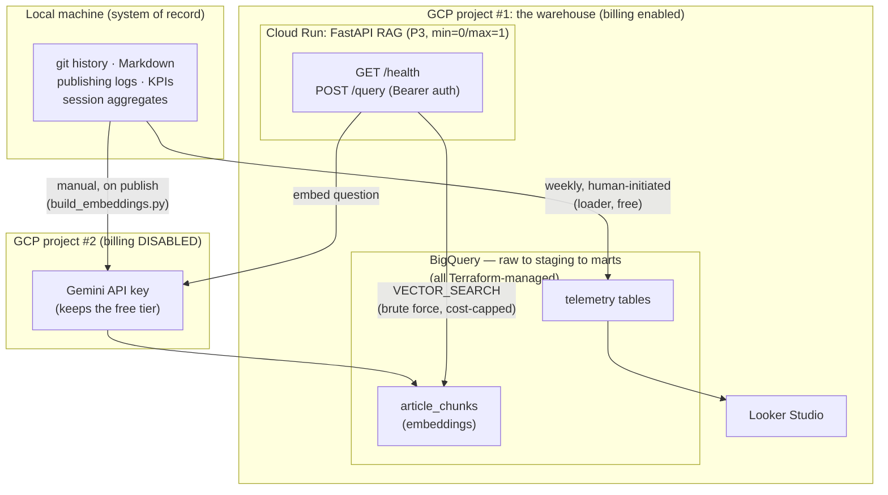

# agent-ops-warehouse

> 🇯🇵 [日本語版](README.ja.md)(翻訳・このページが正本)

Operational telemetry for a one-person AI-agent organization — a BigQuery warehouse, managed entirely by Terraform, running entirely inside GCP's free tier.

I run a small personal studio of AI agents (7 role-defined agents under written governance rules) that ships articles, code, and reviews. This repository is the instrument panel for that studio: what it commits, what it publishes, what it learns from failures, and how its KPIs move — as queryable tables instead of anecdotes.

> **Fork-and-deploy**: `terraform apply` + `python -m loader` gives you the same warehouse in *your* GCP project, on the free tier, in minutes. This repo is a template, not just a diary. Note: `loader/extract_git.py`'s `ALLOWED_REPOS` is hardcoded to this author's own repo names — a fork must edit that list first, or the git-history load silently returns zero rows.

## Why this exists

People increasingly run AI-agent setups, but almost nobody *measures* them. DevOps has observability stacks; personal AgentOps has nothing. This is a reference implementation: small, free, reproducible, and honest about its trade-offs.

## Architecture



Two GCP projects, deliberately: enabling billing on a project makes its Gemini API key *lose* the free tier (BigQuery/Cloud Run keep theirs). The warehouse project has billing on (needed past BigQuery's 60-day sandbox limit), so the Gemini key lives in a second, billing-disabled project instead. Details in the [RAG API](#rag-api) section below.

Design decisions worth stealing (or arguing with):

- **The system of record is the local machine, not the warehouse.** Every BigQuery table is derived data, rebuildable from sources by re-running the loader. That is why infrastructure is *recreated*, never imported, and why losing the warehouse costs nothing.
- **Honesty about scale**: this data is under 10 MB. By size alone, DuckDB would be the right tool. BigQuery wins on *distribution* requirements — zero-ops hosting, shareable dashboards, a remote SQL backend for the RAG API, and a permanent free tier. When the requirements change, the answer changes.
- **Governance as code, all the way down.** The organization is governed by written rules; the infrastructure follows the same principle. `terraform plan` is the review gate, drift detection is the deviation alarm, and the budget alert is a guardrail in code.
- **Vector search without a vector DB**: the RAG phase uses BigQuery `VECTOR_SEARCH` over an audited corpus of published articles. At this corpus size a vector index cannot even be created (5,000-row minimum) — so this is brute-force search, stated plainly, and the interesting part is the governed corpus, not retrieval benchmarks.
- **Append-only raw layer** with a load ledger (`raw_load_runs`) that records what was loaded *and what was excluded* — exclusions are auditable in the public loader code as an allowlist.

## What is deliberately not here

| Not built | Why |
|---|---|
| Airflow / Dagster | A weekly, human-triggered load needs no orchestrator |
| GKE / always-on VMs | Cost sources; Cloud Run covers the API phase |
| Streaming ingestion | Weekly batch; streaming inserts also cost money |
| A dedicated vector DB | One engine (BigQuery) for analytics *and* retrieval is the point |
| Unattended schedulers | Loads are human-initiated by design — a governance choice, not a limitation |

## Privacy boundary

Sources are personal repositories and personal logs only. Git history is scoped by an explicit **allowlist** of personal repositories (`loader/extract_git.py`'s `ALLOWED_REPOS`). Session telemetry is aggregated locally — counts per day, never content — and additionally scoped by the `AOW_EXCLUDED_DIRS` environment variable; **it excludes nothing by default**, so set it yourself if you point `--sessions` at a directory that also holds non-personal session logs. Commit subjects are loaded for private analysis but never rendered on public surfaces; sample data in tests is synthetic (no real metrics, filenames, or commit subjects).

## Quickstart

```bash
# 1. Infrastructure (needs gcloud auth application-default login)
cd terraform
echo 'project_id = "your-project"' > terraform.tfvars
terraform init && terraform apply

# 2. Load your own telemetry
python -m loader --repos ~/your-repos/* --out out/
for t in git_commits articles; do
  bq load --source_format=NEWLINE_DELIMITED_JSON --replace raw.$t out/raw_$t.ndjson
done
```

Free-tier envelope: BigQuery sandbox works without a card (tables expire in 60 days). Enabling billing does **not** clear an existing dataset's default expiration — the dataset must be updated (or recreated), which surfaces here as Terraform drift; that is exactly how a checklist item should be encoded.

## RAG API

`POST /query` runs semantic search (BigQuery `VECTOR_SEARCH`, brute-force — see "Design decisions" above) over the published-article corpus and returns the top-k matching chunks.

```bash
curl -X POST "$RAG_API_URL/query" \
  -H "Authorization: Bearer $RAG_API_TOKEN" \
  -H "Content-Type: application/json" \
  -d '{"question": "your question", "top_k": 5}'

# or, the thin CLI wrapper (same env vars, pretty-printed with jq):
scripts/query_articles.sh "your question"
```

`GET /health` is unauthenticated and returns `{"status": "ok"}` — it is the **only** unauthenticated surface; FastAPI's auto-generated `/docs`, `/redoc`, and `/openapi.json` are disabled in this deployment.

**⚠️ Two separate GCP projects, on purpose.** Enabling billing on a GCP project makes that project's Gemini API key (the `ai.google.dev`-issued kind) *lose* its free tier — unlike BigQuery/Cloud Run, which keep their free tier after billing is enabled. This warehouse project has billing enabled (needed to lift BigQuery's 60-day sandbox table expiry), so `GEMINI_API_KEY` is deliberately issued from a **second, billing-disabled** GCP project and injected via Secret Manager. Reusing this warehouse project's own key would silently forfeit the Gemini free tier.

Cost is bounded, not just "should be free": every query has BigQuery's `maximum_bytes_billed` set to 100 MB (a synchronous, pre-execution hard cap — an oversized scan is rejected before it runs, not billed and refunded after), and the service runs `max_instance_count=1`. On top of that, an in-memory daily request counter (default 100/day, `DAILY_REQUEST_LIMIT` env var) brakes bursts — but honestly: with `min_instance_count=0`, that counter lives inside a process that can scale to zero and back, so it resets on cold start rather than holding for a full UTC day. It is a burst brake against accidental over-calling, not a second guaranteed ceiling. The one load-bearing, guaranteed bound is the 100 MB per-query cap; assuming the daily counter always holds, worst case is about 29% of BigQuery's 1 TiB/month free tier (293GB), but that figure is not a guarantee. Real usage (personal-scale, a few requests a month) stays near 0.01% of the free tier regardless.

## Development

```bash
pytest -q          # 144 tests, TDD-first
ruff check .       # lint
terraform fmt -check && terraform validate
```

CI runs all of the above plus tflint and `dbt parse` on pushes to `main` and on pull requests.

Note: use Python 3.11–3.13 for the venv (dbt-core's `mashumaro` pin breaks on 3.14; if you must use 3.14, `pip install -U mashumaro` after installing dbt).

## Roadmap

- **P2**: dbt Core for staging/marts (tests as data acceptance gates, generated lineage docs), Looker Studio dashboards — done
- **P3**: FastAPI + Cloud Run RAG over the published-article corpus (Gemini free tier, Bearer auth) — done, see "RAG API" above

## Built in public

The build log is published as articles (Japanese) — linked here as they ship.
